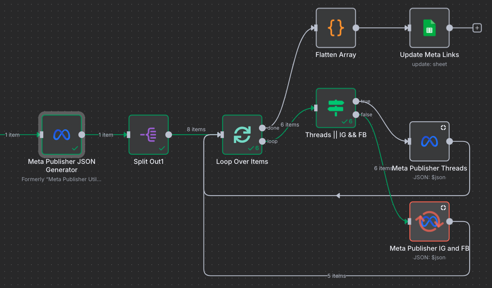

# n8n-nodes-meta-publisher

Publish to **Instagram**, **Facebook Pages**, and **Threads** from n8n — including **Images, Videos, Reels, Stories, and Carousels** — with a single, DRY node.

> Built from the official **n8n community node starter** structure so you can develop, lint, and ship confidently.&#x20;

---

#### Workflows



#### Nodes and Operations


#### JSON Generator Output


## Table of contents

- [Features](#features)
- [Supported resources & operations](#supported-resources--operations)
- [Installation](#installation)
- [Credentials](#credentials)
- [Quick start (Fields mode)](#quick-start-fields-mode)
- [JSON payload mode (optional)](#json-payload-mode-optional)
- [Outputs](#outputs)
- [Rate limits & retries](#rate-limits--retries)
- [Development](#development)
- [Testing locally](#testing-locally)
- [Contributing](#contributing)
- [License](#license)

---

## Features

- One node to publish across **Instagram / Facebook Pages / Threads**
- **Create → poll → publish** workflow handled for you
- **Reels, Stories, Carousels** (IG) + **Photos/Videos** (FB) + **Text/Image/Video/Carousel** (Threads)
- Two input styles:
  - **Fields mode** (simple UI fields)
  - **JSON payload mode** for programmatic/batch posting

- Consistent JSON output (status, IDs, permalinks-ready payloads)
- Friendly polling with jitter; configurable timeouts

---

## Supported resources & operations

**Instagram**

- Publish Image, Publish Video (optional cover image)
- Publish Reel (thumb offset, share to feed)
- Publish Story (image/video)
- Publish Carousel (2–10 items)

**Facebook Pages**

- Publish Photo
- Publish Video (status polled until ready)
- Publish Reel (status polled until ready)
- Publish Story (image/video)
- ~~Publish Multi-Photo~~ (work in progress...)

**Threads**

- Publish Text
- Publish Image (optional alt text)
- Publish Video (optional alt text)
- Publish Carousel (2–20 items)

---

## Installation

### Community Nodes (recommended for users)

- Install `@ralphcrisostomo/n8n-node-meta-publisher` via n8n _Community Nodes_.


## Credentials

Add a credential in n8n called **Meta Graph API** with an **Access Token** (prefer long-lived).
The node will also attempt **OAuth2** if configured in your instance, then fall back to the access token.

> Keep tokens in **Credentials**, not in node fields. This keeps secrets secure and reusable across workflows.

---

## Quick start (Fields mode)

1. Drag **Meta Publisher** into your workflow.
2. Choose **Resource**:
   - Instagram / Facebook Page / Threads

3. Choose **Operation** (e.g., _Publish Reel_).
4. Fill required fields (e.g., IG User ID, Media URL, Caption).
5. Optionally adjust **Polling Interval** and **Max Wait**.
6. Run the workflow.

**Example (IG → Publish Image)**

- Resource: Instagram
- Operation: Publish Image
- IG User ID: `1789…`
- Image URL: `https://…/photo.jpg`
- Caption: `Hello from n8n 🚀`

---

## JSON payload mode (optional)

Instead of filling parameters in the node UI, you can set **Input Source = JSON Property**.
This allows you to feed one or more publishing jobs from the incoming item JSON.

### 1. Configure the Node

- Set **Input Source** → `From JSON Property`
- Set **JSON Property Path** → the field in your input JSON where the job(s) are stored.
  - Use `$json` to pass the entire input item.
  - Use a path like `data.post` if your jobs are nested inside `{"data": { "post": {...}}}`.

### 2. JSON Job Format

Each job must be an object with at least:

- `resource`: `"instagram" | "facebook" | "threads"`
- `operation`: one of the supported operations
- Required fields for that operation (see below)

---

#### **Common Fields**

- `resource` – platform to publish to
- `operation` – type of publish action
- `pollSec` _(optional)_ – polling interval (default: `2`)
- `maxWaitSec` _(optional)_ – max wait before timeout (default: `300`)

---

#### **Instagram**

All Instagram jobs require:

- `igUserId` – Instagram Business User ID
- `autoPublish` _(default: true)_

Operations:

- `publishImage` → `mediaUrl`, `caption?`
- `publishVideo` → `mediaUrl`, `caption?`, `coverUrl?`
- `publishReel` → `videoUrl`, `caption?`, `thumbOffsetMs?`, `shareToFeed?`
- `publishStory` → `mediaUrl`, `storyKind` (`"image"` | `"video"`), `caption?`
- `publishCarousel` → `items[]` (`{ type: "image|video", url: "..." }`), `caption?`

---

#### **Facebook Page**

All Facebook jobs require:

- `pageId` – Page ID

Operations:

- `publishFbPhoto` → `imageUrl`, `caption?`
- `publishFbVideo` → `videoUrl`, `title?`, `description?`

---

#### **Threads**

All Threads jobs require:

- `thUserId` (or `userId` alias) – Threads User ID

Operations:

- `threadsPublishText` → `text`
- `threadsPublishImage` → `imageUrl`, `text?`, `altText?`
- `threadsPublishVideo` → `videoUrl`, `text?`, `altText?`
- `threadsPublishCarousel` → `items[]` (`{ type: "image|video", url: "...", altText? }`), `text?`

You can also pass **an array of jobs** to publish multiple posts in one execution.

### 3. Example: Multiple Jobs

```json
[
	{
		"resource": "instagram",
		"operation": "publishStory",
		"igUserId": "112233445566",
		"mediaUrl": "https://www.example.com/video.mp4",
		"caption": "This is an example caption.",
		"storyKind": "video",
		"autoPublish": true
	},
	{
		"resource": "instagram",
		"operation": "publishStory",
		"igUserId": "112233445566",
		"mediaUrl": "https://www.example.com/image.jpg",
		"caption": "This is an example caption.",
		"storyKind": "image",
		"autoPublish": true
	},
	{
		"resource": "instagram",
		"operation": "publishImage",
		"igUserId": "112233445566",
		"mediaUrl": "https://www.example.com/image.jpg",
		"caption": "This is an example caption.",
		"autoPublish": true
	},
	{
		"resource": "instagram",
		"operation": "publishVideo",
		"igUserId": "112233445566",
		"mediaUrl": "https://www.example.com/video.mp4",
		"caption": "This is an example caption.",
		"coverUrl": "https://www.example.com/image.jpg",
		"autoPublish": true
	},
	{
		"resource": "instagram",
		"operation": "publishReel",
		"igUserId": "112233445566",
		"videoUrl": "https://www.example.com/video.mp4",
		"caption": "This is an example caption.",
		"thumbOffsetMs": 0,
		"shareToFeed": true,
		"autoPublish": true
	},
	{
		"resource": "instagram",
		"operation": "publishCarousel",
		"igUserId": "112233445566",
		"items": [
			{
				"type": "image",
				"url": "https://www.example.com/image.jpg",
				"caption": "This is an example caption."
			},
			{
				"type": "video",
				"url": "https://www.example.com/video.mp4",
				"caption": "This is an example caption."
			}
		],
		"caption": "This is an example caption.",
		"autoPublish": true
	},
	{
		"resource": "facebook",
		"operation": "publishFbPhoto",
		"pageId": "112233445566",
		"imageUrl": "https://www.example.com/image.jpg",
		"caption": "This is an example caption."
	},
	{
		"resource": "facebook",
		"operation": "publishFbVideo",
		"pageId": "112233445566",
		"videoUrl": "https://www.example.com/video.mp4",
		"title": "This is an example title.",
		"description": "This is an example description."
	},
	{
		"resource": "facebook",
		"operation": "publishFbStoryPhoto",
		"pageId": "112233445566",
		"imageUrl": "https://www.example.com/image.jpg"
	},
	{
		"resource": "facebook",
		"operation": "publishFbStoryVideo",
		"pageId": "112233445566",
		"videoUrl": "https://www.example.com/video.mp4"
	},
	{
		"resource": "facebook",
		"operation": "publishFbReel",
		"pageId": "112233445566",
		"videoUrl": "https://www.example.com/video.mp4",
		"description": "FB Reel Description"
	},
	{
		"resource": "threads",
		"operation": "threadsPublishText",
		"thUserId": "112233445566",
		"text": "This is an example text."
	},
	{
		"resource": "threads",
		"operation": "threadsPublishImage",
		"thUserId": "112233445566",
		"imageUrl": "https://www.example.com/image.jpg",
		"text": "This is an example caption.",
		"altText": "This is an example alt text."
	},
	{
		"resource": "threads",
		"operation": "threadsPublishVideo",
		"thUserId": "112233445566",
		"videoUrl": "https://www.example.com/video.mp4",
		"text": "This is an example caption.",
		"altText": "This is an example alt text."
	},
	{
		"resource": "threads",
		"operation": "threadsPublishCarousel",
		"thUserId": "112233445566",
		"items": [
			{
				"type": "image",
				"url": "https://www.example.com/image.jpg",
				"altText": "This is an example alt text.",
				"caption": "This is an example caption."
			},
			{
				"type": "video",
				"url": "https://www.example.com/video.mp4",
				"altText": "This is an example alt text.",
				"caption": "This is an example caption."
			}
		],
		"text": "This is an example caption."
	}
]
```

### 4. Example: Single Job

```json
{
	"resource": "instagram",
	"operation": "publishImage",
	"igUserId": "112233445566",
	"mediaUrl": "https://example.com/image.jpg",
	"caption": "My first IG post",
	"autoPublish": true
}
```

---

## Outputs

Every successful publish returns a consistent JSON shape (fields may vary slightly by resource/operation):

```json
{
	"resource": "instagram|facebook|threads",
	"type": "image|video|reel|story|carousel|text",
	"creationId": "1789...", // IG/Threads container or parent (when applicable)
	"children": ["childId1"], // for carousels
	"status": "FINISHED|PUBLISHED|READY|ERROR|...",
	"published": true,
	"publishResult": { "id": "1790..." }, // media/thread object
	"videoId": "1234567890" // FB video id when relevant
}
```

Use this to chain downstream steps (e.g., fetch permalink, store IDs).

---

## Rate limits & retries

- The node polls at your chosen interval with gentle jitter to be friendly to API limits.
- Increase **Max Wait (sec)** for long videos/reels.
- For high-volume workflows, consider spacing items or batching upstream.

---

## Meta Publisher Utils — how to use

The **Meta Publisher Utils** node generates a ready-to-run JSON payload for the **Meta Publisher** node. It’s perfect for assembling multiple posts (IG/FB/Threads) from a single set of inputs, templates, or upstream data.

---

### What it does

- You select:
  - **Resources** (Instagram, Facebook Page, Threads)
  - **Operations** per resource (checkboxes; only relevant options appear)

- You provide common inputs (e.g., `imageUrl`, `videoUrl`, `caption`, IDs)
- The node outputs **one item** whose `json.data` is an **array of jobs** ready for the Meta Publisher node’s **JSON input** mode.

---

### Basic wiring

1. **Meta Publisher Utils** → **Meta Publisher**

- In **Meta Publisher**:
  - Set **Input Source** = `From JSON Property`
  - Set **JSON Property Path** = `data`

That’s it—Meta Publisher will execute each generated job in the array.

---

### Quick start (example)

1. Drop **Meta Publisher Utils**.
2. In **Resources**, tick **Instagram** and **Threads**.
3. In **Instagram Operations**, tick **Publish Image** and **Publish Reel**.
4. Fill:
   - **IG User ID**: `1789…`
   - **Image URL**: `https://example.com/image.jpg`
   - **Video URL**: `https://example.com/reel.mp4`
   - **Caption**: `Hello from n8n`

5. In **Threads Operations**, tick **Publish Text**:
   - **Threads User ID**: `9876…`
   - **Threads Text**: `Posting from n8n 💚`

6. (Optional) Leave **Skip Missing** enabled to silently skip incomplete jobs.
7. Connect to **Meta Publisher** (JSON mode as above) and run.

The Utils node will output something like:

```json
{
	"data": [
		{
			"resource": "instagram",
			"operation": "publishImage",
			"igUserId": "1789...",
			"mediaUrl": "https://example.com/image.jpg",
			"caption": "Hello from n8n",
			"autoPublish": true
		},
		{
			"resource": "instagram",
			"operation": "publishReel",
			"igUserId": "1789...",
			"videoUrl": "https://example.com/reel.mp4",
			"caption": "Hello from n8n",
			"thumbOffsetMs": 0,
			"shareToFeed": true,
			"autoPublish": true
		},
		{
			"resource": "threads",
			"operation": "threadsPublishText",
			"thUserId": "9876...",
			"text": "Posting from n8n 💚"
		}
	],
	"count": 3
}
```

---

### Editable fields (high level)

- **Resources** (multi-select):
  - Instagram / Facebook Page / Threads

- **Operations** (checkboxes shown only when the resource is selected):
  - **Instagram:** `publishStory`, `publishImage`, `publishVideo`, `publishReel`, `publishCarousel`
  - **Facebook Page:** `publishFbPhoto`, `publishFbVideo`
  - **Threads:** `threadsPublishText`, `threadsPublishImage`, `threadsPublishVideo`, `threadsPublishCarousel`

- **Common inputs:** `imageUrl`, `videoUrl`, `caption`
- **Per-resource IDs:** `igUserId`, `pageId`, `thUserId`
- **Extras:**
  - IG: `coverUrl` (video), `reelVideoUrl`, `thumbOffsetMs`, `shareToFeed`, `igItems` (carousel)
  - IG Story: `storyImageUrl`, `storyVideoUrl` (if omitted, falls back to common URLs)
  - Threads: `text`, `altText`, `thItems` (carousel: image/video entries with `altText`, optional `caption`)

- **Behavior toggles:**
  - **Skip Missing:** Whether to skip incomplete jobs instead of throwing errors.
  - **Include Example Set:** Whether to include example URLs/IDs when you don’t have real ones yet (for demos).

> Tip: When building carousels, supply at least **2 items**; the Utils node will warn/skip otherwise (depending on **Skip Missing**).

---

### Feeding dynamic data

Upstream nodes (e.g., **Set**, **Spreadsheet File**, **HTTP Request**) can provide per-item fields like `igUserId`, `imageUrl`, etc. Use n8n expressions in the Utils node (e.g., `={{$json.imageUrl}}`) to populate the payload dynamically.

- To create **many jobs** from a single record, fill the common fields and tick multiple operations/resources.
- To create **one job per record**, feed the Utils node multiple items (one per row/record). It outputs one payload per input item.

---

### Minimal recipes

**Instagram → Image**

```json
{
	"resource": "instagram",
	"operation": "publishImage",
	"igUserId": "1789...",
	"mediaUrl": "https://example.com/photo.jpg",
	"caption": "My IG post",
	"autoPublish": true
}
```

**Instagram → Story (video)**

```json
{
	"resource": "instagram",
	"operation": "publishStory",
	"igUserId": "1789...",
	"mediaUrl": "https://example.com/story.mp4",
	"caption": "Story time",
	"storyKind": "video",
	"autoPublish": true
}
```

**Facebook Page → Photo**

```json
{
	"resource": "facebook",
	"operation": "publishFbPhoto",
	"pageId": "112233445566",
	"imageUrl": "https://example.com/photo.jpg",
	"caption": "FB photo caption"
}
```

**Threads → Image**

```json
{
	"resource": "threads",
	"operation": "threadsPublishImage",
	"thUserId": "987654321",
	"imageUrl": "https://example.com/thread.jpg",
	"text": "Threads image caption",
	"altText": "Alt text for accessibility"
}
```

---

### Common pitfalls & tips

- **IDs are required** per platform:
  - Instagram → `igUserId`
  - Facebook Page → `pageId`
  - Threads → `thUserId`

- **Skip Missing** is your friend during setup—flip it off for stricter validation later.
- **Carousels:** provide 2–10 items (IG) or 2–20 (Threads). The Publisher node will also **poll children first** for IG.
- **Meta Publisher node:** in JSON mode it expects `platform` internally, but we accept `resource` and normalize it—your Utils output uses `resource` as shown here (works with our Publisher).
- **Permalinks/insights:** use a downstream HTTP Request or an enhanced Publisher to fetch them after publish.

---

### Chaining to Meta Publisher

1. **Meta Publisher Utils** (outputs `{ data: [...] }`)
2. **Meta Publisher**
   - **Input Source** = `From JSON Property`
   - **JSON Property Path** = `data`

3. Optional: add **If** / **Switch** nodes to route successes vs errors (use `status`, `published`, etc.).

---

With this utility in front of your Publisher, you can define one compact set of inputs and instantly generate all the platform-specific jobs your workflow needs.

## Development

This repo uses the same conventions as the n8n node starter:

- TypeScript build to `dist/`
- ESLint + Prettier for quality
- Starter-like scripts: `build`, `lint`, `lintfix`

Typical loop:

```bash
npm i
npm run dev     # tsc --watch
# In another terminal, run n8n and test
```

Refer to n8n’s “Using this starter” steps (generate repo, install deps, lint, test locally, publish) for overall workflow.&#x20;

---

## Testing locally

n8n documents how to **run your node locally**; follow those instructions to link your development build and iterate quickly.&#x20;

---

## Contributing

Issues and PRs are welcome! Please:

- Lint before committing (`npm run lint` / `npm run lintfix`)
- Keep code DRY: use shared client, poller, and resource adapters

---

## License

MIT — same as the official starter.&#x20;

---

### Notes

- Ensure your Meta app has the appropriate permissions for your chosen resource(s) and that your IG account is a professional account linked to a Page when required.
- Threads uses a separate host (`graph.threads.net`) under the Meta umbrella; this node handles it internally — you just choose **Threads** in the UI.
